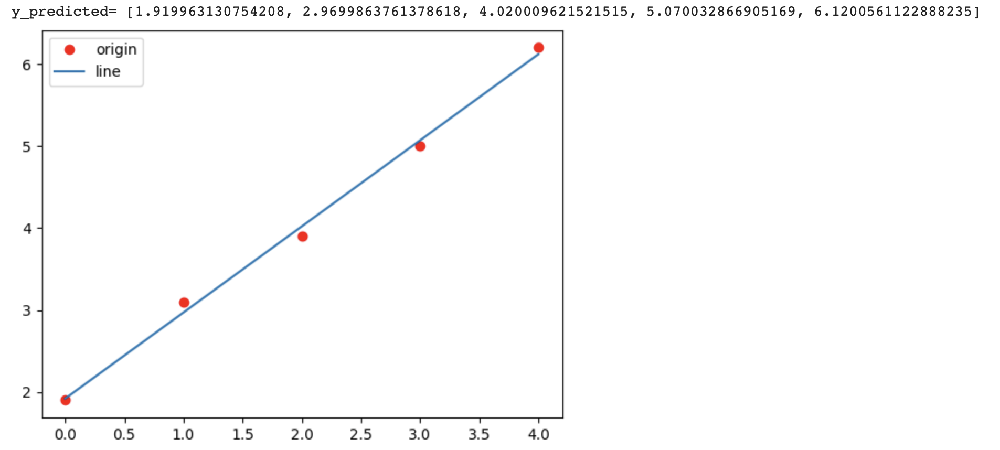

# 程式碼
```
import matplotlib.pyplot as plt
import numpy as np
from scipy.optimize import minimize

x = np.array([0, 1, 2, 3, 4], dtype=np.float32)
y = np.array([1.9, 3.1, 3.9, 5.0, 6.2], dtype=np.float32)

def predict(a, xt):
    return a[0] + a[1] * xt

def MSE(a, x, y):
    total = 0
    for i in range(len(x)):
        total += (y[i] - predict(a, x[i])) ** 2
    return total

def loss(p):
    return MSE(p, x, y)

def optimize():
    p_initial = [0.0, 0.0]  # p的初始猜測值
    result = minimize(loss, p_initial, method='Nelder-Mead')
    return result.x

p = optimize()

# 繪製圖形
y_predicted = list(map(lambda t: p[0] + p[1] * t, x))
print('y_predicted=', y_predicted)
plt.plot(x, y, 'ro', label='origin')
plt.plot(x, y_predicted, label='line')
plt.legend()
plt.show()

```

# 結果
