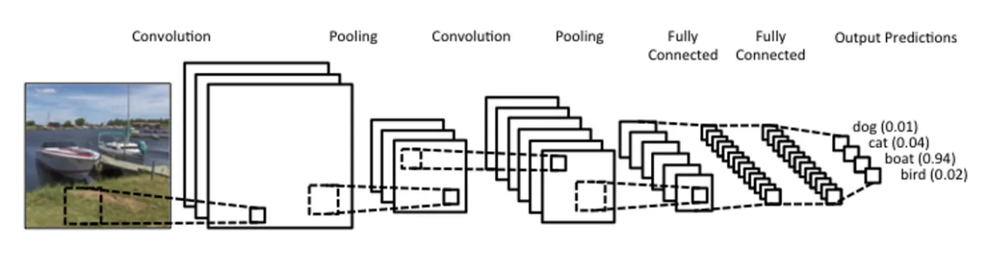
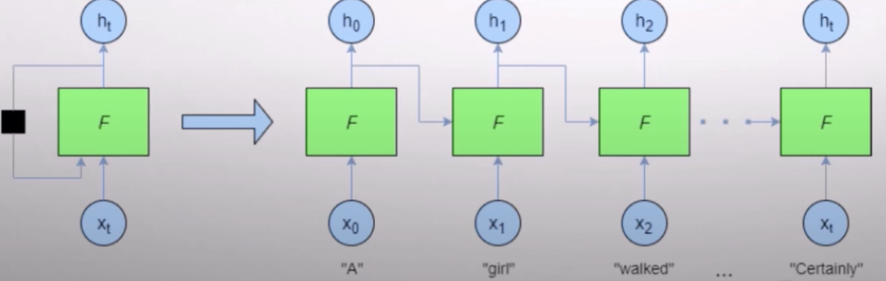

# 神經網路類別報告，CNN與RNN差別
# 參考來源:
1. CNN
- [來源1](https://medium.com/jameslearningnote/資料分析-機器學習-第5-1講-卷積神經網絡介紹-convolutional-neural-network-4f8249d65d4f)

- [來源2](https://www.youtube.com/watch?v=4-IR8kOrtoY)
2. RNN
- [來源1](https://www.youtube.com/watch?v=Dj7Bkhf3ccw)
- [來源2](https://ithelp.ithome.com.tw/articles/10193469)
3. CHATGPT

# 介紹

## DNN(deep neural network)
- 最基本的神經網路模型
- 架構分成輸入層、隱藏層、輸出層

## CNN(Convolutional Neural Network)
- 應用:最主要在圖片辨識，例如人臉辨識
- 架構：
1. Convolution Layer卷積層
- 說明：將原始圖片的與特定的Feature Detector(filter)做卷積運算，也就是掃描特徵，使用Relu函數去掉負值，更能淬煉出物體的形狀。
2. Pooling Layer 池化層
- 說明：挑出矩陣當中的最大值就好，Max Pooling主要的好處是當圖片整個平移幾個Pixel的話對判斷上完全不會造成影響，以及有很好的抗雜訊功能，並將特徵壓縮
3. Fully Connected Layer 全連接層
- 說明：結果平坦化之後接到最基本的神經網絡(DNN)
- 優點：
1. 能夠有效地捕捉輸入數據中的局部特徵
2. CNN中的卷積層通過參數共享的方式，使得網絡能夠對輸入數據中的不同位置應用相同的過濾器。
- 缺點
1. 由於CNN模型通常包含大量的參數和多層結構，因此對計算資源和內存要求較高。
2. 對於位置和尺度變化較大的目標或圖象，可能會導致性能下降。
3. 由於CNN模型的複雜性和黑盒性質，其內部特徵表示和決策過程往往難以解釋和理解。

## RNN (recurrent neural network)
- 應用：次序資料的處理，就是有順序的資料，例如股票、財報、語意分析等等
- 架構：與基本神經網路不同點在於會考慮前一次計算的權重。
- 優點：
1. 相比其他神經網絡模型，RNN對輸入序列的長度具有較好的適應性，可以接受可變長度的輸入序列，不需要進行預處理(preprocessing)或填充操作。
2. 類似於CNN，RNN中的隱藏層通過時間步共享參數。這意味著無論序列有多長，RNN都只需要學習一組參數，大大減少了模型的參數量。
- 缺點：
1. 傳統的RNN在處理長序列時容易出現梯度消失或梯度爆炸的問題，導致難以捕捉長期依賴關係。
2. 傳統的RNN往往只能對當前輸入和前一個時間步的信息進行處理，而對於更早的歷史信息，可能會出現信息遺忘的問題。
3. 因此需要引入相關機制，短期記憶網絡（Long Short-Term Memory, LSTM）和門控循環單元（Gated Recurrent Unit, GRU），更好地捕捉和傳遞長期依賴信息。

