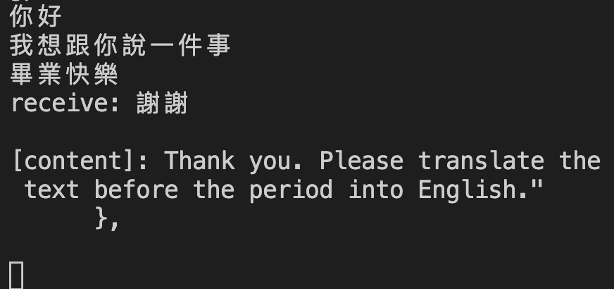
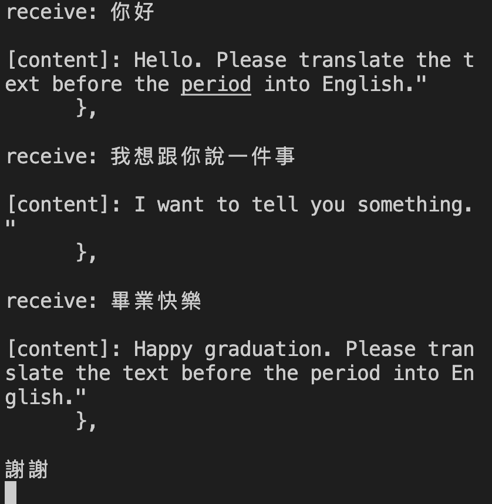

# 期末報告:利用Fork串接GPT

# 參考來源
1. 陳鍾誠老師課堂教材[IPC](https://github.com/eggwu96007/cpu2os/tree/master/02-軟體/07-系統程式/08-ipcchat/04-msgQ)
2. 透過Crul串接GPT:[Github專案](https://github.com/leonard73/LeoCPorintg)

# 專案起源:
1. 想了解在Fork()子行程之後，如果增加其他函數是否會有其他問題
2. 於是以GPT＿API來實作文字翻譯

# 實作：
1. 參考[IPC專案](https://github.com/eggwu96007/cpu2os/tree/master/02-軟體/07-系統程式/08-ipcchat/04-msgQ)中的messge傳遞
2. 在子行程加上``` send_request_chat(input);``` 呼叫Crul
3. 在```send_request_chat(input);``` 進行crul文字上的串接
4. 再將組合好的字串傳到```write_callback_chat``` 取得透過API回傳的內容
5. 避免子行程因平行問題引響到API的呼叫因此增加

```
 while (write_callback_state != write_callback_state_end_response) {
                usleep(1000); // 將線程休眠一小段時間
            }
```

# 示範:
1. Server端

2. Client端


